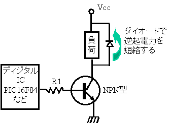

# npn トランジスタのスイッチ回路
# トランジスタの３つのポイント
- Ic = Ib * hfe
  - Ibのhfe倍のIcが流れる。
- Ic ≒ Ie
- Vbe ≒ 0.7V
  - 流す電流の大きさにかかわらず、概ね0.7Vである。

# 計算
### 例1
- DC Forward Current(標準電流): 30mA, Vf: 3.1V(Vfmax:3.6V)の高輝度LED(OSR5JA3Z74A)の場合
- 2SC1815GRはhfe: 300, ベースエミッタ間飽和電圧Vbe(sat): 1V, Ic(max) = 150mA
- トランジスタのBに流す電流Ibは、30mA / 300 = 0.1mA, 2倍程度の余裕をもたせて0.2mAとする。(hFEは温度特性があるため、2~3倍程度の余裕をもたせて計算)
- R1 = (5V - Vbe) / Ib = 4 / 0.2m = 20kΩ
- 小さめの10kΩなどを使う。
[参照](http://zattouka.net/GarageHouse/micon/circuit/TR.htm)
- Vcc: 6Vとすると、
  - R2 = (6V - 3.1V) / 30mA = 96.7Ω
  - R2を100Ωとすると最大2.9V * 2.9V / 100Ω = 84mWとなる。R2は100Ω 1/4Wカーボン抵抗などを使う。

### 例2
- DC Forward Current(max): 1500mA, Vf: 2.95V(Vfmax:3.25V)のパワーLED(XGPWHT 5w)に2.75V100mAを流す場合
- 2SC1815GRはhfe: 300, ベースエミッタ間飽和電圧Vbe(sat): 1V, Ic(max) = 150mA
- トランジスタのBに流す電流Ibは、100mA / 300 = 0.3mA, 2倍程度の余裕をもたせて0.6mAとする。(hFEは温度特性があるため、2~3倍程度の余裕をもたせて計算)(Arduino UnoのDC出力電流:1つのI/Oピン当り20mA程度)
- R1 = (5V - Vbe) / Ib = 4 / 0.6m = 6.7kΩ
- 少し小さめの4.7kΩなどを使う。
- Vcc: 6Vとすると、
  - R2 = (6V - 2.75V) / 100mA = 32.5Ω
  - R2を32.5Ωとすると最大(6V - 2.75V)^2 / 30.5Ω = 0.3Wとなる。R2は33Ω 1Wカーボン抵抗などを使う。

# 注意
- トランジスタでドライブする負荷が、モータやリレーなどのコイルの時には、逆起電力に注意する必要があります。つまり、コイルの電流をOn/Offする場合、その瞬間には、逆向きの高い電圧がコイルの両端に発生します。これを何もしないでおくとこの逆起電力がトランジスタのコレクタエミッタ間にかかり場合によってはトランジスタが壊れることもあります。そこで、これを防止するため、下図のようにダイオードをコイルの両端に並列に接続します。さらにこのとき発生する高い電圧が雑音となってディジタル回路が誤動作することもありますので、このダイオードはコイルに出来るだけ近い位置にとりつけ、逆起電力をショートして流してしまいます。
  - 
  - [トランジスタ回路の基本設計法](http://www.picfun.com/parttrs.html)
- 以下の理由で **ベースエミッタ間抵抗** を入れた方が良いらしいです、抵抗値はＲ１と同じ値でＯＫですね。
  - コレクタしゃ断電流(ICBO=0.6uA)の為にベースに漏れ電流が流れる、これにより(ICBO x hFE：0.6uA x 200)0.12mAの電流がコレクタに流れるのでその電流を逃がす必要が有る。
  - ベースの入力に、トライステート出力やオープンコレクタ出力やスイッチなどを繋いだ場合にその信号がオープンになる可能性があり、オープンになるとICBOの漏れ電流の影響によりコレクタ電流が不安定になります、よって確実にトランジスタをON/OFFさせる必要が有ります。
  - また、抵抗Ｒ１が断線した時や、Ｒ１の値が非常に大きい時において、外来ノイズによりトランジスタがON してしまう可能性が有るのでこれを防ぐ役目も有ります。
  - [トランジスタをマイコン出力のスイッチとして使う方法（１／２）](http://zattouka.net/GarageHouse/micon/circuit/TR.htm)
  - [【『ベース抵抗』と『ベースエミッタ間抵抗』の役割】なんで付いているの？](https://detail-infomation.com/base-resistance-base-emitter-resistance/)
